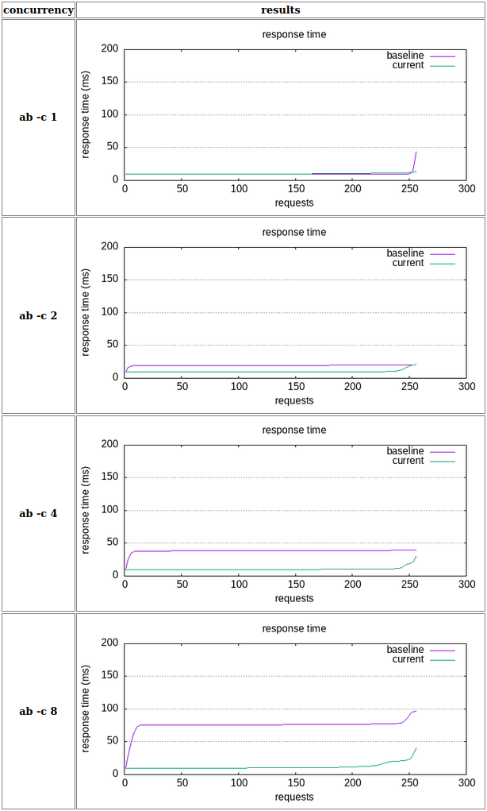
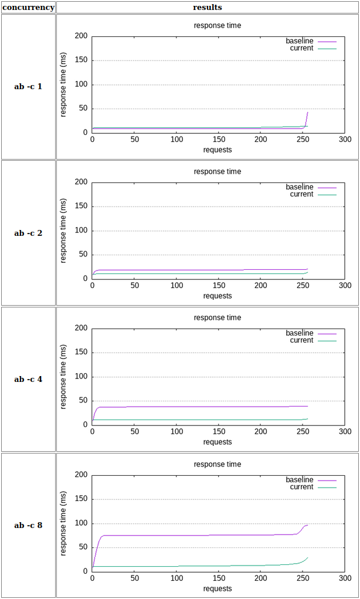

# Tiny Data Server Improvements

## Initial State of the Project

When I first started working on this project, after reading the README.md and BUILD.md, to get a sense of the application's current performance, I ran some baseline benchmarks on my machine. The results looked like this:


As you can see, the response time progressively increases when we have more than four concurrent users, nearly reaching 100 ms with eight users.

## What I've Done to Improve Performance

### Multi-threading

One of my first actions was to read Tornado documentation and understand how it operates. After reading the documentation, I learned that Tornado runs as a single-threaded application by default.

> To minimize the cost of concurrent connections, Tornado uses a single-threaded event loop. (source: [Tornado Docs](https://www.tornadoweb.org/en/stable/guide/async.html))

The documentation also suggested recommendations for putting Tornado into production, such as spawning multiple processes and using an Nginx load balancer. However, for this example, I felt that was a bit overkill. Instead, I opted to spawn multiple processes sharing the same port.

Since the documentation suggests having one process per core, and I have eight cores, I spawned eight processes of `tiny_data_server`. After rerunning the benchmarks, there was a significant improvement:



As you can see, with eight concurrent users, the average performance is comparable to the graph for a single user. I've tried to benchmark the application with 16 users and the performance is not bad, peeking 60ms in the worse case.

```text
Concurrency Level:      16
Time taken for tests:   0.374 seconds
Complete requests:      256
Failed requests:        0
Total transferred:      67584 bytes
Total body sent:        149660416
HTML transferred:       28928 bytes
Requests per second:    683.75 [#/sec] (mean)
Time per request:       23.400 [ms] (mean)
Time per request:       1.463 [ms] (mean, across all concurrent requests)
Connection Times (ms)
              min  mean[+/-sd] median   max
Connect:        0    0   0.2      0       1
Processing:    10   21  10.6     21      60
Waiting:       10   21  10.6     21      59
Total:         10   22  10.6     21      60
```

### Async I/O calls

While reading the documentation I noticed that Tornado can only handle one request concurrently. This means that every request needs to be as non-blocking as possible. So any file I/O like in this example will block the application until they were completed.

I attempted to replace the CSV writing part with an async version. Given my limited experience with Python, I came across some documentation on the [Engineering blog of Twilio](https://www.twilio.com/blog/working-with-files-asynchronously-in-python-using-aiofiles-and-asyncio) where they use `aiofiles`.

After spending some time trying to make it work, using `asyncio` to run the application and running benchmarks, I couldn't see any noticeable improvement. I experimented with various approaches but eventually decided not to invest more time in this for now. Perhaps I'll revisit it in the future.

### Profiler

After this, I decided to setup a profiler to see where the application is spending time and what are the most expensive calls, after googling around for a little bit I decided to use `line_profiler`.

`kernprof -l app.py && python3 -m line_profiler -rmt "app.py.lprof"`

> To facilitate visualizing the results, I disabled multi-threading temporarily. I modified the app to operate in both single-thread and multi-thread modes.

As expected, almost all the request is spent parsing and saving the data into the csv, 99% of the time is spent in these lines:

```python
for record in fr.readlines():
    row = json.loads(record)
    writer.writerow(row)
    # ...
```

Without making any changes initially, I am getting some ideas...

- Can we reduce the size of the JSON data? In the end, we only need data from four out of approximately sixteen columns.
- I'm assuming that this application logic cannot be changed, it needs to get some json data, parse it and append some rows to a csv. what if we broke this process into smaller pieces? We could delegate the actual CSV file I/O to a background process and focus on ensuring that the JSON data contains all the required columns. This could potentially speed up the process and allow for parallelization. Something like: `ingest_data` -> `process_data` -> `save_data`.

After extracting this logic into a separate class and writing some unit tests to make sure I don't break anything (you can run the test with `python3 -m unittest app_tests.py`), I starting experimenting with different implementations of that method to see if I could improve the performance. I didn't have enough time to look into the implementation details of the `csv.DictWriter` or `json.loads`, so probably we could check if there is a faster way of achieving the same result.

After a lot of googling around I managed to save around 4 seconds by buffering the writes to the csv and decoding the `request_body` manually instead of using `io.BytesIO` (I'm leaving both implementations so you can run the profiler and check what results you get)

I also attempted to parallelize the loop since we don't need the data stored in any particular order right now. However, after a few unsuccessful attempts using `ThreadPoolExecutors`, I wasn't getting satisfactory results, and I don't have the time right now to learn how to use them properly.

Before code changes:

```text
Total time: 18.2103 s
File: app.py
Function: write_csv_old at line 41

Line #      Hits         Time  Per Hit   % Time  Line Contents
==============================================================
    41                                               @profile
    42                                               def write_csv_old(self, request_body, csv_name):
    43      1024        251.7      0.2      0.0          records_valid = 0
    44      1024        276.5      0.3      0.0          records_invalid = 0
    45      2048      32998.5     16.1      0.2          with open(csv_name, 'a') as fw:
    46      1024        376.5      0.4      0.0              fieldnames = [
    47                                                           'vendorid',
    48                                                           'tpep_pickup_datetime',
    49                                                           'trip_distance',
    50                                                           'total_amount',
    51                                                       ]
    52      1024       4377.8      4.3      0.0              writer = csv.DictWriter(fw, fieldnames, extrasaction='ignore')
    53      1024        694.1      0.7      0.0              fr = io.BytesIO(request_body)
    54   1639424     304106.8      0.2      1.7              for record in fr.readlines():
    55   1638400     209403.6      0.1      1.1                  try:
    56   1638400   11828292.0      7.2     65.0                      row = json.loads(record)
    57   1638400    5531547.5      3.4     30.4                      writer.writerow(row)
    58   1638400     297704.1      0.2      1.6                      records_valid += 1
    59                                                           except Exception:
    60                                                               records_invalid += 1
    61
    62      1024        320.7      0.3      0.0          return records_valid, records_invalid
```

After code changes:

```text
Total time: 13.9806 s
File: app.py
Function: write_csv at line 13

Line #      Hits         Time  Per Hit   % Time  Line Contents
==============================================================
    13                                               @profile
    14                                               def write_csv(self, request_body, csv_name):
    15      1024        603.6      0.6      0.0          records_valid = 0
    16      1024        297.9      0.3      0.0          records_invalid = 0
    17      1024        148.2      0.1      0.0          max_rows = 100
    18      2048      29676.8     14.5      0.2          with open(csv_name, 'a') as fw:
    19      1024        357.1      0.3      0.0              fieldnames = [
    20                                                           'vendorid',
    21                                                           'tpep_pickup_datetime',
    22                                                           'trip_distance',
    23                                                           'total_amount',
    24                                                       ]
    25      1024       4695.1      4.6      0.0              writer = csv.DictWriter(fw, fieldnames, extrasaction='ignore')
    27      1024     399598.5    390.2      2.9              decoded_body = [line for line in request_body.decode('utf-8').split('\n') if line]
    28      1024        219.2      0.2      0.0              rows = []
    29
    30   1639424     241519.2      0.1      1.7              for record in decoded_body:
    31   1638400     194440.8      0.1      1.4                  try:
    32   1638400    7849370.6      4.8     56.1                      row = json.loads(record)
    33   1638400     348536.3      0.2      2.5                      rows.append(row)
    34
    35   1638400     373129.5      0.2      2.7                      if len(rows) >= max_rows:
    36     16384    4281732.0    261.3     30.6                          writer.writerows(rows)
    37     16384       7055.3      0.4      0.1                          records_valid += len(rows)
    38     16384     248613.9     15.2      1.8                          rows = []
    39                                                           except Exception:
    40                                                               records_invalid += 1
    41
    42      1024        326.3      0.3      0.0              if rows:
    43                                                           writer.writerows(rows)
    44                                                           records_valid += len(rows)
    45
    46      1024        277.0      0.3      0.0          return records_valid, records_invalid
```

I even found custom csv writer implementations (https://stackoverflow.com/questions/63324327/write-a-csv-file-asynchronously-in-python) that I'd love to give a try out of curiosity, so I'll probably make a separate branch to give it a try

## Final Performance

Taking into account only the code changes I had time to implement, the final performance looks like:


This is the final performance obtained in a single machine with 8 cores.

There are more things we could do in order to help reducing this number even more. For example executing the application in multiple instances under a load balancer. In that way we scale the amount of cores and processing power and the load balancer helps distributing the load evenly to all instances resulting in more requests being handled per second.

---

## Nginx Load Balancer

For the sake of curiosity I wanted to give it a try to see how it behaves when using multiple instances behind a load balancer. I'm using Docker for this. I know I won't see any big improvement because at the end Docker is running in the same host where I spawned multiple processes to run the previous benchmarks, but let's try...

After "Dockerizing" the application (see [Dockerfile](Dockerfile)), writing a simple [docker-compose file](docker-compose.yml) and some nginx configuration, I can run it using:

```bash
docker compose up --build -d --scale tiny=4
```

To spin up 4 instances of the application (remember that each instance spawns multiple processes)

I've been playing around for a while with different nginx configurations, processes spawned, cpu limit per instance, etc. And the best benchmark results I got were pretty similar to the best ones we already had, so I cannot see any noticiable improvement.



## Supervisord

Just briefly annotate that before using the `docker compose --scale` approach I tried to use `supervisord`, I configured everything and made it work spawning different processes of `tiny_data_server`, created an upstream in nginx and tried to proxy requests to those services, but I had lots of issues with the `supervisord` Dockerfile I wrote and decided to delete it all and move into the approach from above.

I later learned that all the issues I was having were because of the base image I decided to use (ubuntu:23.04) and some changes they implemented related to how python packages are installed.

I'm leaving the supervisor config files at purpose to revisit this whenever I've some time.
